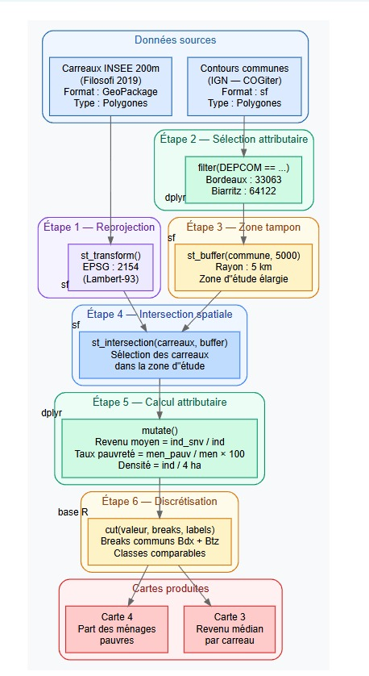
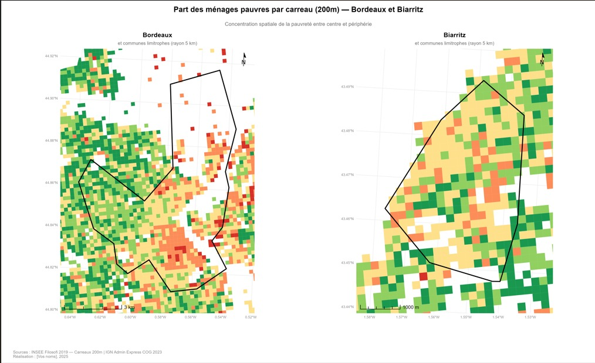

# Objectif

Les géotraitements raster permettent d’analyser les inégalités socio-économiques à une échelle fine grâce aux carreaux INSEE de 200 mètres.

---

# Schéma des géotraitements

Le schéma suivant présente les étapes méthodologiques utilisées pour produire les cartes raster.

---

# Carte 1 — Revenu médian par carreau

Cette carte représente le revenu médian annuel par individu dans les carreaux INSEE de 200 mètres.

---

# Carte 2 — Part des ménages pauvres

Cette carte représente la part des ménages pauvres par carreau de 200 mètres.

---

# Interprétation

Les cartes mettent en évidence des contrastes socio-spatiaux entre centres urbains et périphéries. Bordeaux présente des inégalités plus marquées, tandis que Biarritz montre des contrastes plus localisés.

---

# Sources

- INSEE Filosofi 2019 — données carroyées 200 m
- Limites communales OpenStreetMap
- Géotraitements réalisés sous R