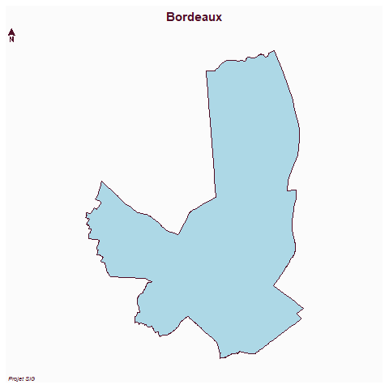
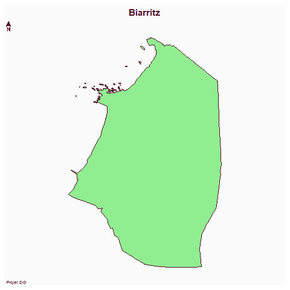

```{r setup, include=FALSE}
knitr::opts_chunk$set(echo = TRUE)

library(sf)
library(mapsf)
```

# Objectif

Les géotraitements vectoriels permettent d’analyser les communes de Bordeaux et Biarritz ainsi que leurs espaces périphériques.

# Données

```{r}
st_layers("data/communes.gpkg")
```

# Lecture des communes

```{r}
communes <- st_read("data/communes.gpkg")

biarritz <- communes[communes$commune == "Biarritz", ]
bordeaux <- communes[communes$commune == "Bordeaux", ]
```

# Cartographie Bordeaux

```{r}
png("images/bordeaux.png")

mf_map(bordeaux, col = "lightblue")
mf_layout("Bordeaux", "Projet SIG")

dev.off()
```



# Cartographie Biarritz

```{r}
png("images/biarritz.png")

mf_map(biarritz, col = "lightgreen")
mf_layout("Biarritz", "Projet SIG")

dev.off()
```



# Interprétation

Les traitements vectoriels permettent d’isoler les communes étudiées afin de préparer les analyses raster et les comparaisons socio-économiques.