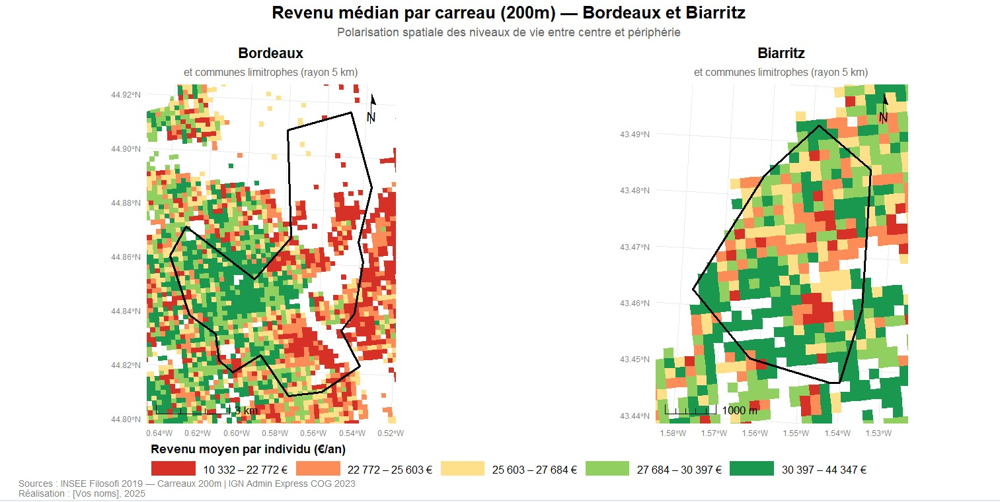

# Objectif

Les jointures permettent d’associer les données statistiques aux données géographiques afin de réaliser des analyses socio-économiques spatialisées.

---

# Principe des jointures

Les données issues de l’INSEE (Filosofi et OFGL) sont reliées aux objets géographiques grâce à des identifiants communs comme les codes INSEE ou les identifiants des carreaux.

Cette opération permet d’afficher les indicateurs statistiques directement sur les cartes et d’analyser les contrastes socio-spatiaux entre les centres urbains et les périphéries.

---

# Exemple de jointure sous R

```{r}
library(sf)
library(dplyr)

# Lecture des données géographiques
communes <- st_read("data/communes.gpkg")

# Lecture des données statistiques
ofgl <- read.csv("data/ofgl.csv")

# Aperçu des données
head(ofgl)
```

---

# Exemple de résultat cartographique

La carte suivante illustre le résultat d’une jointure entre les données statistiques de l’INSEE et les géométries des carreaux utilisés dans l’analyse raster.



---

# Interprétation

Les jointures permettent de représenter spatialement plusieurs indicateurs socio-économiques :
- le revenu médian
- la part des ménages pauvres
- les contrastes centre / périphérie

Ces traitements facilitent l’analyse des inégalités sociales entre Bordeaux et Biarritz à une échelle fine grâce aux données carroyées de l’INSEE.

---

# Sources

- INSEE Filosofi 2019
- OFGL
- OpenStreetMap
- Géotraitements réalisés sous R