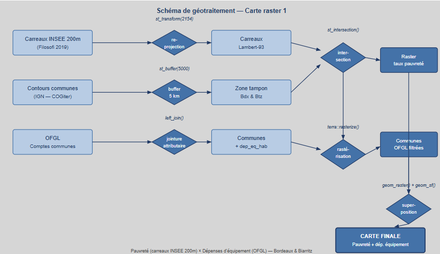

## Introduction

Cette page présente les **jointures attributaires** réalisées dans le cadre de ce projet. Une jointure attributaire est une opération qui consiste à **relier un tableau de données socio-économiques à une couche géographique** via un identifiant commun, sans modifier la géométrie des entités. Elle constitue le lien essentiel entre les données spatiales et les données statistiques, rendant possible la cartographie thématique.

Dans ce projet, la jointure attributaire a été mobilisée pour enrichir les contours communaux IGN avec les données financières de l'OFGL, afin de produire les couches nécessaires aux géotraitements raster.

---

## Schéma de géotraitement

La jointure attributaire est visible dans le schéma de géotraitement raster ci-dessous : elle correspond à l'étape `left_join()` qui relie les données OFGL aux contours communaux IGN, en amont de la rastérisation.



*Figure 1 — Le schéma de géotraitement raster fait apparaître la jointure attributaire (étape `left_join()`) entre les comptes communes OFGL et les contours IGN.*

---

## Principe de la jointure attributaire

Une jointure attributaire fonctionne sur le même principe qu'une jointure SQL : elle met en correspondance deux tables via une **clé commune**, ici le **code INSEE commune**, présent à la fois dans les données géographiques IGN et dans les données tabulaires OFGL.

---

## Jointure réalisée

### OFGL × Communes IGN

| Paramètre | Valeur |
|-----------|--------|
| Table géographique | Contours communes IGN COGiter |
| Table attributaire | Comptes consolidés des communes (OFGL 2024) |
| Clé commune | Code INSEE commune |
| Type de jointure | `left_join()` |
| Variable jointe | `dep_eq_hab` (dépenses d'équipement €/hab) |

```{r jointure, echo=TRUE, eval=FALSE}
# Chargement des données OFGL
ofgl <- read.csv("data/ofgl_2024.csv")

# Jointure attributaire : communes IGN × données OFGL
communes_ofgl <- communes %>%
  left_join(ofgl, by = c("INSEE_COM" = "code_insee"))

# Vérification du résultat
head(communes_ofgl[, c("INSEE_COM", "NOM_COM", "dep_eq_hab")])
```

---

## Pourquoi un `left_join()` ?

| Type de jointure | Comportement | Choix retenu |
|-----------------|-------------|-------------|
| `left_join()` | Conserve toutes les lignes de la table géographique, même sans correspondance OFGL | ✅ **Oui** |
| `inner_join()` | Ne conserve que les lignes présentes dans les deux tables | ❌ Non |
| `right_join()` | Conserve toutes les lignes de la table droite | ❌ Non |
| `full_join()` | Conserve toutes les lignes des deux tables | ❌ Non |

Le `left_join()` garantit qu'**aucune géométrie communale n'est perdue** lors de la jointure, même si certaines communes sont absentes des données OFGL. Les communes sans données financières apparaissent avec des valeurs `NA`, visibles sur la carte, plutôt que supprimées silencieusement.

---

## Place de la jointure dans la chaîne de traitement

| Étape | Opération | Type |
|-------|-----------|------|
| 1 | Chargement des communes IGN | Vecteur |
| 2 | Chargement des données OFGL | Tabulaire |
| **3** | **Jointure `left_join()` OFGL × communes** | **Jointure attributaire** |
| 4 | Rastérisation des communes enrichies | Raster |
| 5 | Superposition avec les carreaux Filosofi | Raster + Vecteur |

Sans cette jointure, les données OFGL — purement tabulaires — ne pourraient pas être représentées cartographiquement.

---

## Limites et précautions

- **Format de la clé** : le code INSEE peut être stocké différemment selon les sources (entier vs chaîne de caractères), ce qui peut bloquer la jointure
- **Millésimes différents** : les données IGN (2023) et OFGL (2024) ne sont pas du même millésime — des fusions de communes entre ces dates peuvent entraîner des codes non concordants
- **Valeurs manquantes** : les communes sans correspondance OFGL génèrent des `NA` à gérer avant la rastérisation
- **Double comptage** : si l'OFGL contient plusieurs lignes par commune, la jointure peut dupliquer des géométries — un filtre préalable est nécessaire

---

## Conclusion

La jointure attributaire est une opération fondamentale en SIG : simple dans son principe, elle conditionne pourtant la qualité de l'ensemble de la chaîne de traitement. Dans ce projet, elle permet de faire le lien entre les **géométries communales** et les **ressources financières locales**, ouvrant la voie à une analyse croisée des inégalités à deux échelles — communale et infra-communale — qui constitue le cœur de la démarche comparative entre Bordeaux et Biarritz.